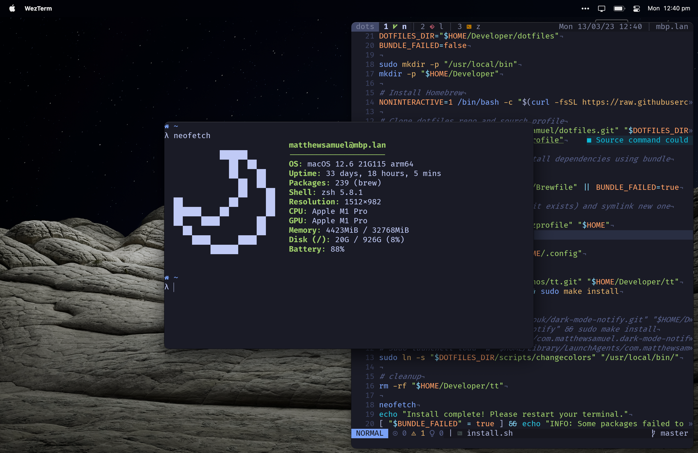

# Matt's Dotfiles

A collection of dotfiles that I use for customising my machine.



## Installation

1. Install macOS Command Line Tools by running:
   ```bash
   xcode-select --install
   ```
1. Run the install script
   ```bash
   sudo curl -fsSL "https://raw.githubusercontent.com/mjsamuel/dotfiles/master/install.sh" | sh
   ```

## Post-Install Tasks
N/A
